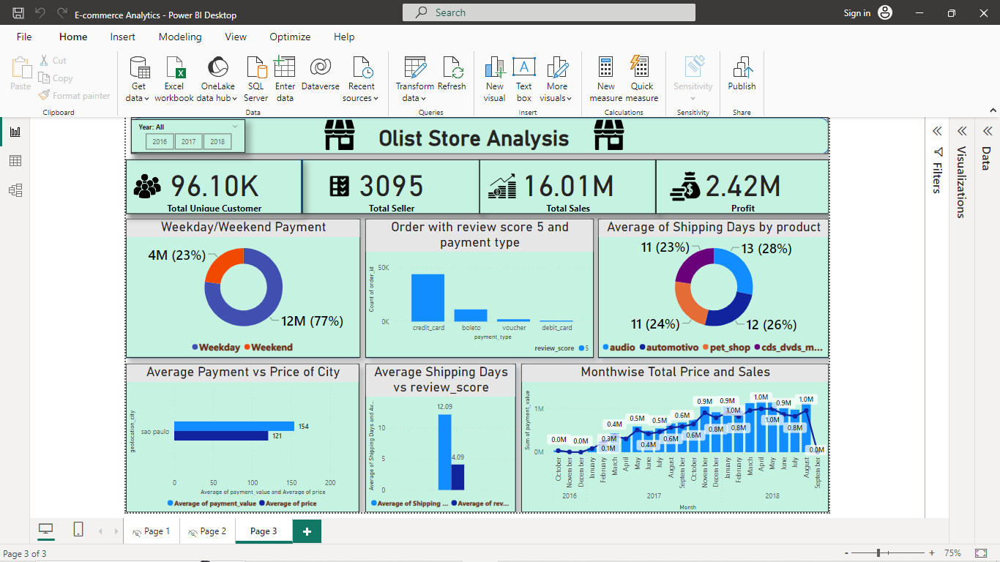
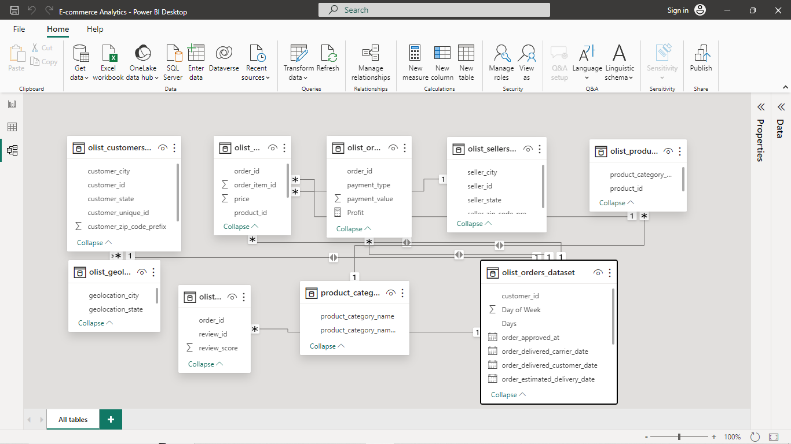

# E-Commerce-Analytics


## Table of Contents
---
- [ Project Overview]( #project-overview)
- [Data Sources](#data-sources)
- [ Tools](#tools)
- [Data Cleaning](#data-cleaning)
- [KPI](#kpi)
- [Data Analysis](#data-analysis)
- [Findings](#findings)


### Project Overview
---

Led a project focused on leveraging data analytics to optimize e-commerce operations and enhance customer experience.Utilized MySQL, Power BI and Excel to analyze data and derive actionable insights. Implemented data driven strategies to drive business growth and improve operational efficiency.


### Data Sources
---

In this analysis two data sets were used which contained detailed information about the bank.
- "Finance_1.csv"
- "Finance_2.csv"
### Tools
---
- Excel - Data Cleaning
- MySQL - Data Analysis
- Power BI - Creating Reports


### Data Cleaning
---

In the initial data preparation phase , we performed the following tasks:
1. Data loading and inspection
2. Handling missing values
3. Data cleaning and formatting

### KPI
---
1. Weekday vs Weekend (Order_purchase_timestamp) Payment Statistics
2. Number of Orders with a review score of 5 and payment type as a credit card
3. The average number of days taken for order_delivered_date for pet_shop
4. Average price and payment values from customers of Sau Paulo City
5. Relationship between shipping days (order_delivered_customer_date- order_purchase_timestamp) vs review scores


### Data Analysis
---

```
SELECT * FROM e_commerce_analytics.olist_customers_dataset;
# KPI 1 : Weekday vs Weekend (Order_purchase_timestamp) Payment Statistics

SELECT 
    CASE
        WHEN DAYOFWEEK(STR_TO_DATE(o.order_purchase_timestamp, '%Y-%m-%d')) IN (1 , 7) THEN 'Weekend'
        ELSE 'Weekday'
    END AS DayType,
    COUNT(DISTINCT o.order_id) AS TotalOrders,
    ROUND(SUM(p.payment_value)) AS TotalPayments,
    ROUND(AVG(p.payment_value)) AS AveragePayment
FROM
    orders_dataset o
        JOIN
    payments_dataset p ON o.order_id = p.order_id
GROUP BY DataType;


# KPI 2 : Number of Orders with a review score of 5 and payment type as a credit card

SELECT 
    COUNT(DISTINCT p.Order_id) AS NumberOfOrders
FROM
    payments_dataset p
        JOIN
    reviews_dataset r ON p.order_id = r.order_id
WHERE
    r.Review_score = 5
        AND p.payment_type = 'Credit Card';
        
        
# KPI 3 : The average number of days taken for order_delivered_date for pet_shop

SELECT 
    product_category_name,
    ROUND(AVG(DATEDIFF(order_delivered_customer_date,
                    order_purchase_timestamp))) AS Avg_delivery_time
FROM
    orders_dataset o
        JOIN
    items_dataset i ON i.order_id = o.order_id
        JOIN
    products_dataset p ON p.product_id = i.product_id
WHERE
    p.product_category_name = 'Pet Shop'
        AND o.order_delivered_customer_date IS NOT NULL;
        

# KPI 4 : Average price and payment values from customers of Sau Paulo City
SELECT 
    ROUND(AVG(i.price)) AS Average_Price,
    ROUND(AVG(p.payment_value)) AS Average_Payment
FROM
    customers_dataset c
        JOIN
    order_dataset o ON c.customer_id = o.customer_id
        JOIN
    items_dataset i ON o.order_id = i.order_id
        JOIN
    payments_dataset ON o.order_id = p.order_id
WHERE
    c.city = 'Sau Paulo';
    
    
# KPI 5 : Relationship between shipping days (order_delivered_customer_date- order_purchase_timestamp) vs review scores

SELECT 
    ROUND(AVG(DATEDIFF(order_delivered_customer_date,
                    order_purchase_timestamp)),
            0) AS AvgShippingDays,
    Review_score
FROM
    order_dataset o
        JOIN
    review_dataset r ON o.order_id = r.order_id
WHERE
    order_delivered_customer_date IS NOT NULL
        AND order_purchase_timestamp IS NOT NULL
GROUP BY review_score;
```

```
POWER BI

```
## DASHBOARD


## MODELVIEW



### Findings
---
The analysis results are summarized as follows:
- Average shipping days for the top 5 products :  
    ###### Telefonia:12.58(21.52%) ,
   ###### Tablets_impressao_imagem: 12.39(21.37%),  
  ###### Telefonia_fixa : 12.08(20.84%),
  ###### Utilidades_domesticas:10.62(18.32%), 
  ###### Sinalizacao_e_seguranca:10.41(17.95%)
- Top 5 sales :

   ###### 2018 April : 1157738.68,
  ###### 2018 May : 1147595.55,
  ###### 2018 March:  1123356.38,
  ###### 2018 Aug :  1120792.94
  ###### 2018 January:  1060219.38

- Total orders with review score 5 and Payment type:
   ###### Credit card 43792 followed by
   ###### Boleto 11227,
    ###### Voucher 2141,
    ###### Debit card 916


  


  


